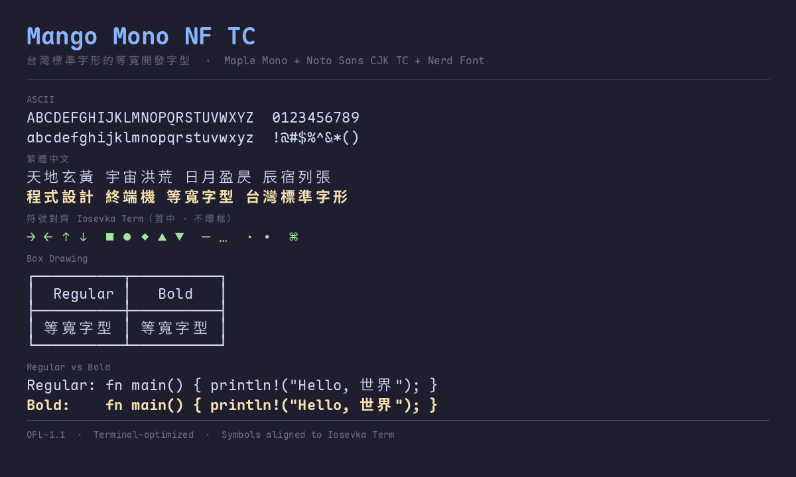

# Mango Mono NF TC

台灣標準字形的等寬開發字型 — 英文 + CJK + Nerd Font icon，單一 .ttf 跨平台零設定。



## 字型組成

| 部分 | 來源 | 授權 |
|------|------|------|
| 英文等寬 + Ligature | [Maple Mono](https://github.com/subframe7536/maple-font) v7.9 | OFL-1.1 |
| CJK 繁體中文（台灣標準） | [Noto Sans CJK TC](https://github.com/googlefonts/noto-cjk) DemiLight | OFL-1.1 |
| Nerd Font Icon | [Nerd Fonts](https://github.com/ryanoasis/nerd-fonts) | MIT |
| 符號對齊基準 | [Iosevka Term](https://github.com/be5invis/Iosevka) v34.6.1 | OFL-1.1 |

## 特色

- 英文字形舒適寬敞（Maple Mono 原創設計）
- CJK 使用台灣教育部標準字形（非 GB 18030 / CN 標準）
- Nerd Font icon 齊全（開發工具 icon）
- 中英文寬度 2:1 嚴格對齊
- **符號逐字對齊 Iosevka Term** — 箭頭、幾何、標點、技術符號全部置中不爆框
- **Box Drawing 無縫 tiling** — 框線端點觸界，畫框接得起來
- **Regular + Bold 兩字重** — 終端粗體中文真的會變粗
- 單一 .ttf，跨平台零設定

## 下載

| 字重 | 檔案 |
|------|------|
| Regular (400) | [`MangoMono-NF-TC-Regular.ttf`](MangoMono-NF-TC-Regular.ttf) |
| Bold (700) | [`MangoMono-NF-TC-Bold.ttf`](MangoMono-NF-TC-Bold.ttf) |

## 後處理 Pipeline

字型合成後經過 6 階段後處理，確保終端機最適化：

1. `strip_ligatures.py` — 移除 GSUB ligature lookup（終端不該有連字）
2. `normalize_advances.py` — advance 對齊 East Asian Width（全形 2:1）
3. `complete_glyph_pairs.py` — 補缺字（實心 ▰ 由空心 ▱ 衍生）
4. `fit_glyph_to_advance.py` — 爆框符號等比例縮進 advance 框
5. `align_symbols.py` — 全符號區段逐字對齊 Iosevka Term 佔格比例
6. `verify_font_metrics.py` — Golden invariant 量化驗證

## 自行建置

需要 Python 3 + fontTools：

```bash
pip install fonttools cu2qu
python build-font.py
```

輸入檔：
- `MangoMono-NF-Base.ttf` — Maple Mono NF base（本 repo 附帶）
- Noto Sans CJK TC（需自行安裝，macOS: `~/Library/Fonts/NotoSansCJKtc-DemiLight.otf`）

輸出：`MangoMono-NF-TC-Regular.ttf`

## 授權

本合成字型遵循 [SIL Open Font License 1.1](LICENSE)。
原始字型的著作權歸各自作者所有。

"Maple Mono" 為 subframe7536 的 Reserved Font Name，本衍生字型依 OFL 規範改名為 "Mango Mono"。
